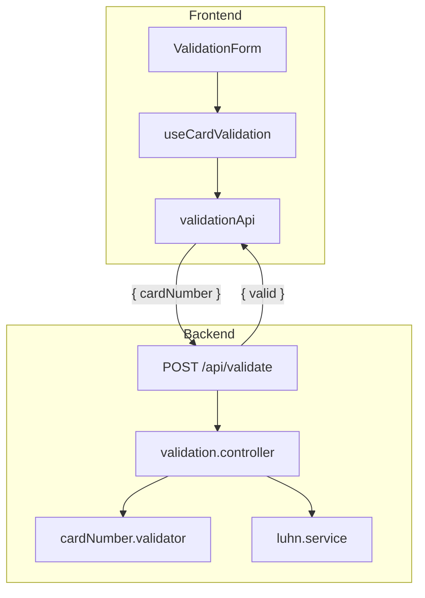

# Credit Card Validator

A full-stack credit card validation application that verifies card numbers using the Luhn checksum algorithm. Validation runs exclusively on the backend API; the React frontend provides a clean, accessible interface for submitting card numbers and displaying results.

## Tech Stack

- **Frontend:** React, TypeScript, Vite, CSS Modules
- **Backend:** Node.js, TypeScript, Express
- **Testing:** Vitest, Supertest, Testing Library

## Architecture



## Prerequisites

- Node.js 20+
- npm 10+

## Quick Start

```bash
# Install dependencies
npm install

# Copy environment file (optional — defaults work for local dev)
cp .env.example .env

# Start backend (port 3000) and frontend (port 5173)
npm run dev
```

Open [http://localhost:5173](http://localhost:5173) in your browser.

## API

### `POST /api/validate`

**Request**

```json
{
  "cardNumber": "4539148803436467"
}
```

**Success — 200 OK**

```json
{ "valid": true }
```

**Validation Error — 400 Bad Request**

```json
{
  "error": {
    "message": "cardNumber must contain only digits (spaces and dashes allowed)",
    "code": "VALIDATION_ERROR"
  }
}
```

### `GET /api/health`

Returns `{ "status": "ok" }` for health checks.

## Project Structure

```
creditcardvalidator/
├── backend/
│   ├── src/
│   │   ├── config/         # Environment configuration
│   │   ├── controllers/    # HTTP request handlers
│   │   ├── middleware/     # Error handling, 404
│   │   ├── routes/         # Route definitions
│   │   ├── services/       # Luhn algorithm (business logic)
│   │   ├── types/          # Shared TypeScript types
│   │   └── validators/     # Input validation & normalization
│   └── tests/
│       ├── unit/           # Luhn service tests
│       └── integration/    # API endpoint tests
└── frontend/
    └── src/
        ├── components/     # UI components
        ├── hooks/          # useCardValidation state hook
        ├── services/       # API client
        ├── styles/         # Global CSS & design tokens
        └── types/          # Frontend types
```

## Testing

```bash
# Run all tests
npm test

# Backend only
npm run test -w backend

# Frontend only
npm run test -w frontend
```

## Design Decisions

- **Backend-only validation:** The Luhn algorithm runs server-side so validation logic cannot be bypassed by manipulating client code.
- **Clean architecture:** Routes, controllers, services, validators, and middleware are separated for testability and maintainability.
- **No database or auth:** Per assignment requirements; the app is stateless.
- **CSS Modules over frameworks:** Keeps dependencies minimal while meeting the fintech UI requirements.

## Deployment

### Docker Compose

```bash
docker compose up --build
```

- Frontend: [http://localhost:8080](http://localhost:8080)
- Backend API: [http://localhost:3000](http://localhost:3000)

### Environment Variables

| Variable     | Default                  | Description              |
| ------------ | ------------------------ | ------------------------ |
| `PORT`       | `3000`                   | Backend server port      |
| `NODE_ENV`   | `development`            | Runtime environment      |
| `CORS_ORIGIN`| `http://localhost:5173`  | Allowed frontend origin  |

## Future Improvements

- Rate limiting on the validation endpoint
- Card brand detection (BIN lookup)
- End-to-end tests with Playwright
- Internationalization
